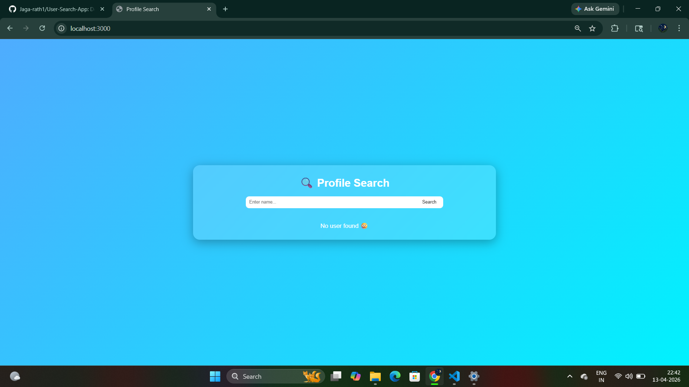
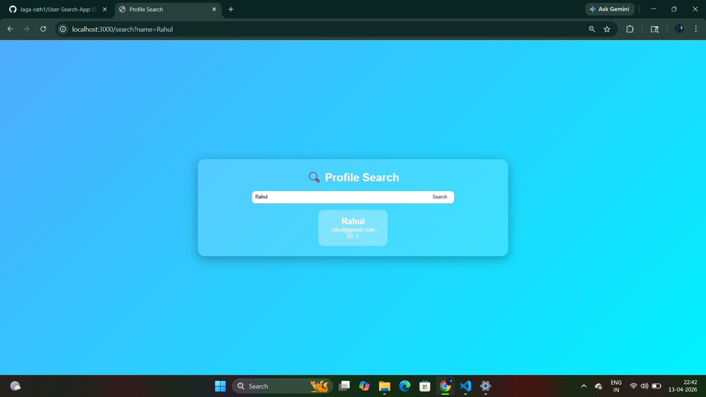

# 🔍 User Search App

A backend-driven search application built with Node.js, Express, and EJS that allows users to search names dynamically from a JSON dataset.

---

## 🚀 Features
- 🔎 Search users by name
- ⚡ Fast filtering using JavaScript
- 🔡 Case-insensitive search
- 📄 Dynamic UI rendering with EJS
- 📂 Data fetched from local JSON file

---

## 🛠️ Tech Stack
- Node.js
- Express.js
- EJS
- JSON

---

## 📸 Screenshots

### 🔹 Home Page


### 🔹 Search Result


---

## 📂 Project Structure

project/
│
├── views/
│ └── search.ejs
│
├── public/
│
├── users.json
├── app.js
├── package.json
└── README.md


---

## ⚙️ How It Works
1. User enters a name in the search box
2. Request is sent to `/search` route
3. Server reads data from `users.json`
4. Filters matching users
5. Displays results dynamically using EJS

---

## ▶️ Run Locally

```bash
npm install
node app.js
Open in browser:
http://localhost:3000

##💡 Future Improvements

🔗 Connect with MongoDB database
🔐 Add authentication system
⚡ Implement live search (without reload)
🎨 Improve UI with CSS/Bootstrap
👨‍💻 Author

Jagan Kumar Rath

⭐ Support

If you like this project, give it a ⭐ on GitHub!

